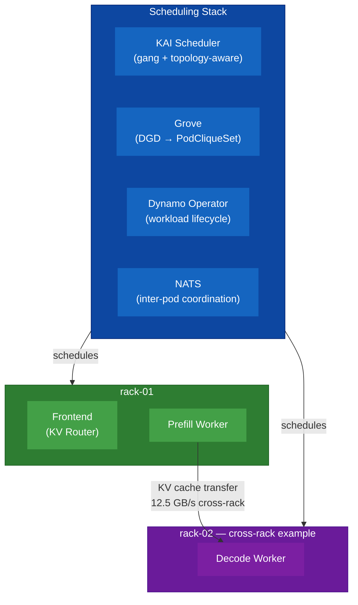

# NCX Dynamo Demo

A lightweight, local Kubernetes demonstration of how **NVIDIA Dynamo** and **NVIDIA NCX** software supports disaggregated inference. Intended to allow more comprehensive hands-on learning of NCX software components than existing simple quickstarts, with a focus on Dynamo-driven use cases.

> **Not Production.** Uses GPU mockers (simulated inference), Kind cluster (containerized), and local machine resources. Designed for learning and portfolio demonstration — not a development environment.

---

## Demo

[Watch the walkthrough on YouTube](https://www.youtube.com/watch?v=9O3iQbwQq08)

The walkthrough covers the **mocker benchmark track**: gang scheduling, rack-aware
placement, and the measurable latency cost of KV transfer bandwidth. The GPU inference
track (real vLLM, disaggregated same-GPU) is documented separately in
[`docs/gpu-inference-runbook.md`](docs/gpu-inference-runbook.md).

---

## Disaggregated Inference Foundations

Disaggregated inference splits LLM serving into two stages running on separate workers:

- **Prefill** — processes the user prompt, produces a KV cache
- **Decode** — consumes the KV cache, generates response tokens

The critical constraint: after prefill completes, the KV cache must transfer to the decode worker. The cost of that transfer scales with the size of the cache (proportional to prompt length) and inversely with network bandwidth. This demo makes that cost observable by running two placement scenarios and measuring the latency difference.

### What You'll See

The table below shows sample results from the Ubuntu reference environment. Absolute numbers will differ across machines — the stable signal is the absolute latency delta between scenarios (~15–19 ms), which reflects the KV transfer cost at ISL=4096. The ratio varies because slower hardware raises the base overhead, diluting it.

| Scenario | p50 Latency | p99 Latency | Throughput |
|----------|-------------|-------------|-----------|
| **Same-Rack** (400 GB/s) | 9.4 ms | 12.6 ms | 374 req/s |
| **Cross-Rack** (12.5 GB/s) | 28.3 ms | 29.9 ms | 136 req/s |
| **Cross/Same ratio** | **3.0×** | **2.4×** | **0.36×** |

The 400 GB/s and 12.5 GB/s figures represent intra-rack (NVLink-class) and inter-rack (100 GbE) bandwidths respectively — the same parameters KAI Scheduler optimizes against in a real Superpod environment. Gang scheduling ensures the prefill and decode workers start together or not at all; rack-aware placement determines where they land.

---

## Architecture



Two required setup steps, then independent demo tracks:

### Cluster Setup
- Kind cluster (1 control plane + 3 workers)
- Rack topology labels (`rack-01`, `rack-02`) — mirrors the node labels real cluster infrastructure applies for topology-aware placement
- Fake GPU resource advertisement satisfies Dynamo operator requirements; no GPU is consumed by the mocker workload
- GPU device passthrough (if a GPU is present) is reserved for a future real-inference extension

### Scheduling Stack
- **KAI Scheduler** — Gang scheduling, queue management, topology-aware placement
- **Grove** — Converts `PodCliqueSet` CRDs into ganged deployments
- **Dynamo Platform** — Disaggregated inference operator + NATS coordination bus
- Placeholder workload validates gang scheduling before real workers are deployed

### Mocker Benchmark (demo track)
- **Dynamo Mocker** — Simulates disaggregated inference by parameterizing KV transfer bandwidth; no GPU required
- **AIPerf** — Measures latency (p50, p99) and throughput
- Both scenarios use forced node affinity to demonstrate the latency cost that topology-aware scheduling is designed to prevent

For full design details, see [`docs/architecture.md`](docs/architecture.md).

---

## Getting Started

Full instructions are in the runbooks. Two independent demo tracks are available after
core setup — run one, the other, or both.

**Prerequisites** — `make validate-prereqs` (requires Docker, Kind, kubectl, Helm)

### Core Setup (required for all tracks)

**Step 1 — Create cluster:**
```bash
make cluster-setup
```
Auto-detects GPU presence; uses a mocker-only cluster template if no GPU is found. See [`docs/cluster-runbook.md`](docs/cluster-runbook.md).

**Step 2 — Install scheduling stack:**
```bash
make stack-install
```
Requires an NGC API key (free NVIDIA developer account is sufficient). See [`docs/stack-runbook.md`](docs/stack-runbook.md) for credential setup before running this step.

### Track 1 — Mocker Benchmark (no GPU required)

Simulates disaggregated inference by parameterizing KV transfer bandwidth. Measures the
latency delta between same-rack and cross-rack placement. No NVIDIA GPU required.

```bash
make install-aiperf              # One-time: install aiperf benchmark tool
make download-model              # One-time: cache Qwen3-0.6B (~1.5 GB)
make mocker-deploy               # Deploy mocker workers (same-rack scenario)
make run-benchmark               # Benchmark same-rack latency
make benchmark-cross-rack && make run-benchmark
make compare-results             # Print side-by-side latency comparison
```
See [`docs/mocker-benchmark-runbook.md`](docs/mocker-benchmark-runbook.md).

### Track 2 — GPU Inference (requires NVIDIA GPU)

Real token generation via disaggregated vLLM on the dedicated `rack-gpu` node. The
mocker benchmark track does not need to be run first — this track is independent.

```bash
make download-model              # One-time: cache Qwen3-0.6B (~1.5 GB) if not already done
make gpu-prepull                 # One-time: load vllm-runtime image into kind nodes (~9 GB)
make gpu-deploy                  # Deploy disaggregated DGD (Frontend + prefill + decode)
make gpu-validate                # Smoke test: /health + inference request
make gpu-stream                  # Streaming response (shows real token arrival)
```
See [`docs/gpu-inference-runbook.md`](docs/gpu-inference-runbook.md).

---

## Documentation

| Document | Purpose |
|----------|---------|
| [`docs/architecture.md`](docs/architecture.md) | Design decisions, topology, GPU strategy, future extensions |
| [`docs/cluster-runbook.md`](docs/cluster-runbook.md) | Cluster creation, prerequisites, validation |
| [`docs/stack-runbook.md`](docs/stack-runbook.md) | Scheduling stack installation, NGC credential setup |
| [`docs/mocker-benchmark-runbook.md`](docs/mocker-benchmark-runbook.md) | Mocker deployment, AIPerf benchmarking, troubleshooting |
| [`docs/gpu-inference-runbook.md`](docs/gpu-inference-runbook.md) | Real vLLM inference: deploy, validate, benchmark, troubleshoot |
| [`docs/project-structure.md`](docs/project-structure.md) | File layout and generated artifact reference |

---

## Key Concepts

**KV-Cache Transfer** — The bandwidth-sensitive handoff between prefill and decode workers. At ISL=4096 tokens and Qwen3-0.6B's 57,344 bytes/token KV size, a 400 GB/s link transfers the cache in ~0.6 ms; a 12.5 GB/s link takes ~18.8 ms. That delta is what this demo measures.

**Gang Scheduling** — KAI Scheduler enforces all-or-nothing execution for a set of pods (frontend + prefill + decode). No partial deployments; if capacity isn't available for the full gang, no pods start.

**Rack-Aware Placement** — In production Superpod environments, nodes carry rack and NVLink-domain labels. KAI uses these to co-locate gang members within the same rack, minimizing KV transfer cost. This demo applies the same label mechanism to Kind nodes and forces both scenarios to make the cost observable.

---

## What This Demo Does/Does Not Do

| Capability | Status |
|------------|--------|
| Gang scheduling and rack-aware placement | Demonstrated |
| KV-cache transfer latency impact | Measured (placement-dependent delta) |
| Dynamo operator integration with Kubernetes | Validated |
| Fast cluster bring-up/teardown | Supported (reproducible via Makefile) |
| Real GPU inference (disaggregated vLLM) | Included (requires NVIDIA GPU) |
| Multi-cluster federation | Not included |
| Observability stack (Prometheus, Grafana) | Not included |

---

## Learn More

- [NVIDIA NCX Documentation](https://docs.nvidia.com/ncx/index.html)
- [NVIDIA Dynamo — Getting Started](https://docs.nvidia.com/dynamo/getting-started/quickstart)
- [KAI Scheduler](https://github.com/NVIDIA/KAI-Scheduler) — Kubernetes-native gang scheduler
- [Grove](https://github.com/NVIDIA/grove) — PodCliqueSet orchestration
- [AIPerf](https://github.com/ai-dynamo/dynamo/tree/main/benchmarks/aiperf) — Benchmarking tool (part of the Dynamo project)

---

## Contributing

This is a demonstration project. For bug reports or improvements:

1. Check existing issues
2. Include: OS/version, Docker/Kind/kubectl versions, steps to reproduce, logs from relevant pods

---

## License

MIT License — See [`LICENSE`](LICENSE)

---

## Acknowledgments

Built on open source projects (all Apache 2.0 licensed):
- **[NVIDIA Dynamo](https://github.com/ai-dynamo/dynamo)** — Disaggregated inference platform
- **[KAI Scheduler](https://github.com/NVIDIA/KAI-Scheduler)** — Kubernetes-native gang scheduler
- **[Grove](https://github.com/NVIDIA/grove)** — PodCliqueSet orchestration
- **[Kind](https://github.com/kubernetes-sigs/kind)** — Local Kubernetes for testing
- **[AIPerf](https://github.com/ai-dynamo/dynamo/tree/main/benchmarks/aiperf)** — Benchmarking tool

---

**Last Updated:** 2026-04-15
**Status:** GPU inference track added — real vLLM disaggregated inference on rack-gpu node
