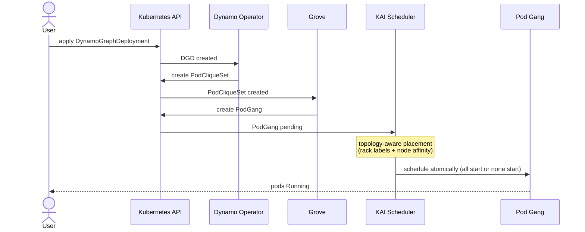
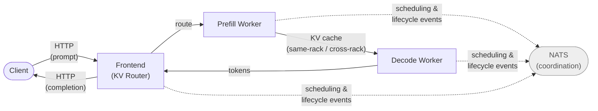

# NCX Dynamo Demo — Architecture & Design

## Project Scope

This demonstration showcases **NVIDIA Dynamo** in a local Kubernetes environment — specifically gang scheduling, disaggregated inference architecture, and latency-aware placement on simulated rack topology.

For the full Dynamo system architecture, see the [NVIDIA Dynamo Architecture Overview](https://docs.nvidia.com/dynamo/design-docs/overall-architecture). This demo implements the Request Plane components (Frontend / KV Router, Prefill Worker, Decode Worker) and the scheduling layer (KAI Scheduler, Grove, Dynamo Operator). The Global Planner, KV Block Manager, NIXL, and multi-cluster coordination are out of scope.

**Not a production system.** The environment uses:
- Local GPU (RTX 3070 Ti) — used for real inference compute in Track 2; for scheduling validation only in Track 1
- Kind cluster with containerized nodes
- Two demo tracks: GPU mocker (Track 1, no GPU required) and real vLLM disaggregated inference (Track 2, requires NVIDIA GPU)
- AIPerf benchmarking to measure latency differences from placement changes

---

## Design Goals

### Primary Objectives
1. **Demonstrate gang scheduling** — KAI + Grove coordinate groups of pods (prefill + decode workers)
2. **Measure placement impact on latency** — Same-rack (NVLink analog, 400 GB/s) vs cross-rack (100 GbE, 12.5 GB/s)
3. **Showcase Kubernetes + Dynamo integration** — CRD-driven platform with NATS coordination
4. **Support iterative development** — Fast cluster bring-up/teardown via Makefile

### Why These Choices?
- **Kind cluster:** Local development, full Kubernetes API, matches production topology abstractions
- **GPU mockers:** Avoids complexity of vLLM/CUDA setup; latency is dominated by KV transfer simulation, not compute
- **Rack topology via labels:** Simulates multi-rack deployment; placement constraints are testable
- **AIPerf benchmarking:** Portable latency measurement tool, compatible with any HTTP inference backend

---

## Architecture Layers

### Layer 1: Infrastructure (Kind Cluster)

**Topology:**
- 1 control plane
- 3 worker nodes split across 2 racks (rack-01: 2 workers, rack-02: 1 worker)
- All workers share one physical RTX 3070 Ti via NVIDIA container runtime
- HuggingFace model cache mounted read-only on all nodes

**GPU Setup:**
- GPU device files (`/dev/nvidia0`, `/dev/nvidia-uvm`, `/dev/nvidiactl`) mounted into worker nodes
- NVIDIA container runtime binaries mounted for pod GPU access
- `nvidia` RuntimeClass available for pods requesting GPU
- No GPU Operator — avoids library dependency issues with containerized environment

### Layer 2: Scheduling Stack

| Component | Version | Purpose |
|-----------|---------|---------|
| **KAI Scheduler** | v0.14.0 | Kubernetes native gang scheduler with queue management |
| **Grove** | v0.1.0-alpha.7 | Operator: converts `PodCliqueSet` → ganged deployments |
| **Dynamo Platform** | v1.0.1 | Disaggregated inference operator + NATS messaging |

**Data Flow:**
1. User applies `DynamoGraphDeployment` (DGD) CRD
2. Dynamo operator creates 3 pod templates: Frontend, Prefill Worker, Decode Worker
3. Each template becomes a `PodClique` (via Grove); related cliques form `PodCliqueSet`
4. KAI Scheduler enforces gang scheduling: all pods in cliques start together or none start — this applies to both the Phase 2 placeholder and the Phase 3 DGD workload. The placeholder is a smoke test of this mechanism using simple nginx pods; it is removed at the start of Phase 3 to free node resources for the DGD on the constrained local cluster.
5. NATS bus coordinates inter-pod communication (worker discovery, request routing)



### Component Topology Rationale

This demo deploys the minimum viable disaggregated configuration: **1 frontend, 1 prefill worker, 1 decode worker**.

In production, Dynamo's planner dynamically computes prefill and decode replica counts based on traffic (input/output sequence length distribution, throughput targets, and ITL SLA). Decode workers typically outnumber prefill workers because token generation is the longer operation. No fixed ratio is prescribed upstream.

For this demo, production asymmetry is not meaningful — there is no real compute to model, and the mocker's latency is entirely determined by KV transfer delay, not worker count. The 1:1 topology cleanly isolates the placement variable: one prefill per scenario, one decode worker placed on the target rack.

This topology has no bearing on a future KVBM extension, which concerns cache block management within a single worker's GPU memory rather than prefill/decode ratios.

---

### Layer 3: Workload (Mock Dynamo Mocker)

**Image:** `ghcr.io/urregum/ncx-dynamo-demo/dynamo-mocker:1.0.1`

**Components:**
- **Frontend** (Python + integrated KV router)
  - Listens on HTTP port 8000
  - Routes requests to prefill/decode workers based on KV cache overlap (`--router-mode kv`)
  - The router is not a separate pod — it is an integrated mode of the frontend process, consistent with upstream Dynamo's implementation
  - Resolves tokenizer from HF cache for KV routing logic

- **Prefill Worker** (Rust-based mock)
  - Simulates KV-cache production via `--disaggregation-mode prefill`
  - On completing a request, injects a real sleep delay modeling KV transfer to the decode worker:
    ```
    delay_ms = num_input_tokens × kv_bytes_per_token / (bandwidth_GB_s × 1e9) × 1000
    ```
  - `kv_bytes_per_token` is auto-computed from model config (`num_layers × 2 × num_kv_heads × head_dim × dtype_bytes`)
  - `--speedup-ratio 0` suppresses all GPU compute delays; only the KV transfer handoff delay remains
  - `--kv-transfer-bandwidth` is set only on the prefill worker — it models the cost of transferring the cache *from* prefill *to* decode

- **Decode Worker** (Rust-based mock)
  - Consumes KV cache via `--disaggregation-mode decode`
  - No bandwidth arg; the transfer cost is modeled on the prefill side as the cost of moving the KV cache to the decode worker

---

## Scenario Definitions

Both scenarios measure the same thing: the cost of the KV cache transfer from Prefill Worker to Decode Worker. Only the placement — and the bandwidth that placement implies — changes between them.



### Scenario A: Same-Rack (NVLink Analog)
**Goal:** Measure latency when prefill and decode collocate (best case)

**Configuration:**
- Prefill: rack-01 (node affinity)
- Decode: rack-01 (node affinity)
- KV bandwidth: 400 GB/s (simulates NVLink3 intra-rack)

**Reference Result at ISL=4096, concurrency=4:**
- p50: ~9.4 ms
- p99: ~12.6 ms
- Throughput: ~374 req/s

### Scenario B: Cross-Rack (East-West Hop)
**Goal:** Measure latency when prefill and decode span racks (worst case)

**Configuration:**
- Prefill: rack-01 (node affinity)
- Decode: rack-02 (node affinity)
- KV bandwidth: 12.5 GB/s (simulates 100 GbE inter-rack link)

**Reference Result at ISL=4096, concurrency=4:**
- p50: ~28.3 ms (~19 ms above same-rack)
- p99: ~29.9 ms
- Throughput: ~136 req/s

**Key Insight:** Placement dramatically affects latency due to KV transfer cost. The mock allows manipulation of network parameters to show the effect without real network modification.

---

## Environment Setup

Setup instructions are in the phase runbooks:

- [Cluster Setup](cluster-runbook.md) — Kind cluster, rack topology, GPU scaffolding
- [Stack Installation](stack-runbook.md) — KAI, Grove, Dynamo platform, NGC credentials
- [Mocker Benchmark](mocker-benchmark-runbook.md) — Track 1: mocker deployment, AIPerf, benchmark scenarios
- [GPU Inference](gpu-inference-runbook.md) — Track 2: real vLLM, disaggregated inference on rack-gpu node

---

## Key Technical Decisions

### 1. HF Cache Access (Rust + Python Split)
**Why the model is needed at all:** The mocker does not run inference, but two components still require the HuggingFace model cache:
- **Frontend** — loads the tokenizer to support KV-aware request routing (`--router-mode kv`)
- **Prefill worker** — reads model config (`num_layers`, `num_kv_heads`, `head_dim`, `dtype`) to compute `kv_bytes_per_token`, which drives the KV transfer delay formula

The model weights (~1.2 GB) are present in the cache but unused. What matters is the tokenizer vocabulary and the model config JSON.

**Problem:** Dynamo mocker (Rust) writes to `$HF_HOME/hub` (needs writable dir). Python HF Hub reads from `$HF_HUB_CACHE` (read-only mount).

**Solution:**
```bash
HF_HOME=/tmp                              # Rust writes here (writable)
HF_HUB_CACHE=/root/.cache/huggingface     # Python reads here (read-only)
```

Plus: Model name must include namespace slash (`Qwen/Qwen3-0.6B`) so Rust cache dir matches Python's (`models--Qwen--Qwen3-0.6B`).

### 2. Kind Cluster Design
**Why not GPU Operator?**
- GPU Operator is enterprise-focused (drivers, monitoring, MIG management)
- Kind nodes are containers; GPU Operator adds unnecessary complexity
- Manual mount of nvidia-container-runtime is simpler and sufficient

**Why GPU mocker for Track 1 (not vLLM)?**
- Track 1 measures placement impact on KV transfer latency — compute fidelity adds no signal
- 9+ GB vLLM image per node is slow to deploy for a bandwidth-measurement goal
- The mocker parameterizes KV transfer delay directly, isolating the variable being measured
- Real vLLM inference is Track 2 (see [`docs/gpu-inference-runbook.md`](gpu-inference-runbook.md))

### 3. Rack Topology via Labels
**Why Kubernetes labels, not actual network config?**

In a real Superpod environment, nodes are labeled with their rack and NVLink domain during cluster provisioning. KAI Scheduler is designed to use these labels for topology-aware PodClique placement — keeping gang members within the same rack to minimize KV transfer cost.

This demo applies the same mechanism: `rack=01` / `rack=02` labels on Kind worker nodes, and node affinity in the DGD manifests, mirror exactly what production infrastructure would provide. The mocker then parameterizes the bandwidth to match each topology.

Both placement scenarios are **forced via node affinity** rather than left to the scheduler. Without a prior workload to create load imbalance, KAI would always schedule optimally (same-rack) — so forcing cross-rack is necessary to demonstrate the penalty that topology-aware placement is designed to prevent.

### 4. NATS for Coordination
Dynamo operator auto-injects NATS_SERVER env var into all pods. Workers use NATS to:
- Register with frontend (service discovery)
- Coordinate request routing
- Achieve leader election among parallel workers

---

## Validation Checkpoints

Each gate confirms the architectural invariant that subsequent phases depend on — not just that components are running, but that the property the demo relies on is actually present.

| Phase | What It Validates | Architectural Purpose | Command |
|-------|------------------|----------------------|---------|
| Cluster | Cluster health, rack labels, GPU resources | Rack topology labels are foundational — placement scenarios fail silently without them; GPU advertisement satisfies the operator's resource requirements | `make validate-cluster` |
| Stack | KAI + Grove + Dynamo running, placeholder gang-scheduled | Confirms gang scheduling is operational before DGD workload depends on it; the placeholder uses the same gang mechanism as real Dynamo workers | `make validate-stack` |
| Mocker | DGD healthy, inference works, disaggregation confirmed via worker IDs | Confirms prefill and decode are separate pods with the expected KV handoff; `nvext.worker_id` in responses proves the disaggregation path is active | `make validate-mocker` |
| GPU | `/health` returns 200, inference returns a real token response | Confirms vLLM is running, NixlConnector handoff is functional, and the disaggregated GPU topology is serving requests end-to-end | `make gpu-validate` |

---

## Performance Characteristics

### What This Demo Measures
- **KV Transfer Latency:** Dominant component of end-to-end latency in disaggregated inference
- **Scheduling Overhead:** KAI gang scheduling, Grove PodCliqueSet → deployment conversion
- **Placement Sensitivity:** How rack affinity affects latency (~15–19 ms absolute delta at ISL=4096; ratio varies by host CPU speed)

### What This Demo Does NOT Measure
- Compute latency (suppressed via `--speedup-ratio 0`)
- Real GPU utilization or memory bandwidth
- Tokenizer latency (single batch, no batching optimization)
- Production network characteristics (simulated via bandwidth param)

---

## Potential Extensions

### KV Block Manager (KVBM) Demo
- Extend a decode worker with KVBM configuration (block eviction policy, prefix cache size)
- Demonstrates cache block management and prefix reuse on a single GPU without requiring multi-GPU transfer paths
- NIXL (NVIDIA Interconnect Library — the real KV transfer substrate using NVLink/RDMA) is not applicable in this environment; the mocker simulates its latency consequence only
- Does not require changes to the current 1:1 prefill/decode topology

### Multi-Cluster Federation
- Deploy multiple kind clusters in different network zones
- Use Istio/Envoy for cross-cluster traffic
- Test KAI scheduler with global queue spanning clusters

### Scheduling Scenario Demonstrations
- Introduce asymmetric prefill/decode replica counts to reflect production-realistic topology (e.g., 1 prefill, 2–3 decode workers)
- The current 1:1 prefill/decode ratio is intentional for mocker baseline: latency is determined entirely by KV transfer, not worker count, so asymmetry adds no signal. Phase 5 would introduce real or semi-real compute where decode saturation becomes meaningful.
- PodCliqueSet and DGD manifests will need replica count and scheduling group updates
- `make show-placement` and validation scripts may need updates to expect more than 3 pods

### Observability Stack
- Deploy Prometheus + Grafana (already running in many demos)
- Scrape Dynamo operator metrics (request rates, queue depth)
- Correlate with latency measurements from AIPerf

---

## Glossary

| Term | Definition |
|------|-----------|
| **DGD** | DynamoGraphDeployment CRD; deployed by user, orchestrates workload |
| **PodCliqueSet** | Grove CRD; groups related pods (frontend, prefill, decode) |
| **PodGang** | Scheduling group created by KAI; enforces all-or-nothing execution |
| **KV Cache** | Key-Value cache produced by prefill, consumed by decode |
| **Disaggregation** | Splitting inference into prefill + decode stages on different workers |
| **ISL** | Input Sequence Length (prompt tokens); affects KV size |
| **ITL** | Inter-Token Latency; time between successive output tokens during decode; an SLA target for production Dynamo deployments |
| **NIXL** | NVIDIA Interconnect Library; the real KV transfer substrate using NVLink/RDMA in production; the mocker simulates its latency consequence without requiring NIXL |
| **OSL** | Output Sequence Length (response tokens); drives decode iterations |

---

**Last Updated:** 2026-04-16
**Audience:** Demo users, documentation readers, future contributors
